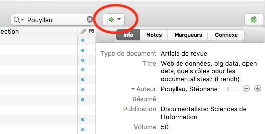

# Connecteurs ISIDORE pour Zotero

(English version above)

## Enrichir sa bibliothèque Zotero avec ISIDORE

L'outil Zotero permet d'utiliser des moteurs de recherche pour rechercher ou completer des références bibliographiques. Nous proposons ici deux connecteurs ISIDORE pour Zotero permettant d'utiliser ISIDORE pour completer sa bibliothèque de références bibliographiques à partir de recherche sur les auteurs.

### Fonctions

L'ajout d'ISIDORE à Zotero permet :

- De compléter des références à partir d'une recherche sur le nom de l'auteur ou de l'auteure : c'est le «ISIDORE, aide-moi à trouver ce qu'il/elle a publié.»
- De trouver des documents dans lequel l'auteure ou l'auteur est cité : c'est le «ISIDORE, qu'as-tu sur l'auteur/auteure ?»

### Fonctionnement

En sélectionnant une référence dans Zotero, il suffit d'ouvrir avec la flèche verte située à droite du champ de recherche des références :

Puis de sélectionner les liens "ISIDORE, ..." de votre choix :

Une fenêtre de votre navigateur s'ouvre alors avec la réponses proposées par ISIDORE.

### Installation :

Fermez votre Zotero, Ouvrir le fichier <Zotero>/locate/engines.json (ex. sous Mac : Users/utilisateur/Zotero/locate ou voir https://www.zotero.org/support/zotero_data) dans un éditeur de texte (Atom, TextEdit, etc.) et ajoutez juste après le premier [ le code json contenu dans engines.json ou le code suivant :

`{
  "name": "ISIDORE, aide-moi à trouver ce qu'il/elle a publié.",
  "alias": "ISIDORE",
  "icon": "https://isidore.science/favicon.ico",
  "_urlTemplate": "https://isidore.science/s?q=author:\"{rft:aulast?}, {rft:aufirst?}\"",
  "description": "ISIDORE est le moteur de recherche académique des SHS.",
  "hidden": false,
  "_urlParams": [],
  "_urlNamespaces": {
    "rft": "info:ofi/fmt:kev:mtx:journal",
    "z": "http://www.zotero.org/namespaces/openSearch#",
    "": "http://a9.com/-/spec/opensearch/1.1/"
  },
  "_iconSourceURI": "https://isidore.science/favicon.ico"
},
{
  "name": "ISIDORE, qu'as-tu sur l'auteur/auteure ?",
  "alias": "ISIDORE",
  "icon": "https://isidore.science/favicon.ico",
  "_urlTemplate": "https://isidore.science/s?q=\"{rft:aufirst?}+{rft:aulast?}\"",
  "description": "ISIDORE est le moteur de recherche académique des SHS.",
  "hidden": false,
  "_urlParams": [],
  "_urlNamespaces": {
    "rft": "info:ofi/fmt:kev:mtx:journal",
    "z": "http://www.zotero.org/namespaces/openSearch#",
    "": "http://a9.com/-/spec/opensearch/1.1/"
  },
  "_iconSourceURI": "https://isidore.science/favicon.ico"
},`

### English

Connectors are available for english people, please use engines_en.json.

### Español

Los conectores están disponibles en español.

## Crédits

Auteur : Stéphane Pouyllau -
Remerciements : Caroline Muller (pour les tests), Sean Takats, Laurent Capelli, Adrien Desseigne, Elifsu Sabuncu.
